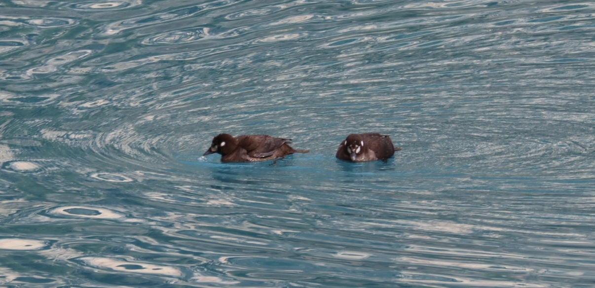

  

<h1 align="center">
  Hey there, I'm Hannah Chen!
  
</h1>

  

---

### About Me :
I am a **Computer Science** and **Applied Mathematics** student at the **University of Virginia School of Engineering**

---

### Languages and Tools :

  &nbsp;
  &nbsp;
  &nbsp;
  &nbsp;
  &nbsp;
  &nbsp;
  &nbsp;
  &nbsp;

